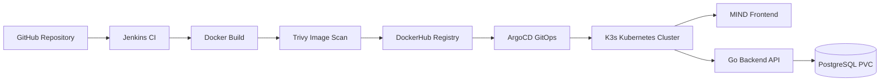
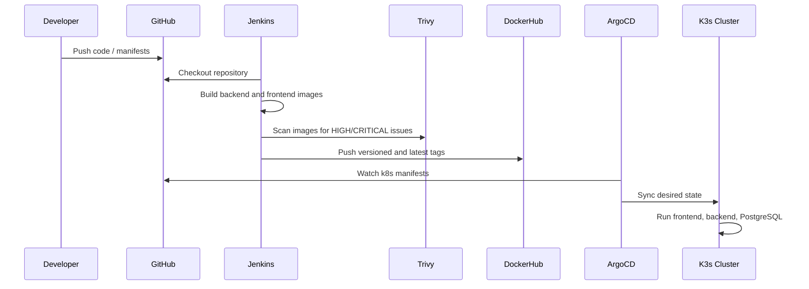

<p align="center">
  
</p>

<h1 align="center">DEPI DevSecOps Project — MIND Notes App</h1>

<p align="center">
  <strong>GitHub → Jenkins → Docker → Trivy → DockerHub → ArgoCD → K3s Kubernetes</strong>
</p>

<p align="center">
  
  
  
  
  
  
</p>

---

## 🚀 Project Overview

This project demonstrates a complete **DevSecOps delivery pipeline** for the **MIND Notes App** using AWS EC2, Jenkins, Docker, Trivy, DockerHub, K3s Kubernetes, and ArgoCD GitOps.

The application consists of:

| Layer | Technology |
|---|---|
| Frontend | React + Nginx |
| Backend | Go API |
| Database | PostgreSQL |
| CI | Jenkins |
| Image Registry | DockerHub |
| Security Scan | Trivy |
| Kubernetes | K3s on AWS EC2 |
| GitOps CD | ArgoCD |
| Dynamic DNS | DuckDNS |

---

## 🔗 Live URLs

| Service | URL |
|---|---|
| Jenkins | http://depi-jenkins-depi.duckdns.org:8080 |
| MIND App | http://depi-k3s-depi.duckdns.org:30080 |
| API Health | http://depi-k3s-depi.duckdns.org:30080/api/health |
| ArgoCD | http://depi-k3s-depi.duckdns.org:32000 |

Demo login:

| Email | Password |
|---|---|
| demo@example.com | demo123456 |

---

## 🧭 Architecture



---

## 🔁 CI/CD Pipeline



---

## 🧱 AWS Infrastructure

| Server | Purpose | Public Access |
|---|---|---|
| `depi-jenkins-server` | Jenkins CI server | `depi-jenkins-depi.duckdns.org:8080` |
| `depi-k3s-server` | K3s Kubernetes + ArgoCD + App | `depi-k3s-depi.duckdns.org` |

K3s server details:

| Item | Value |
|---|---|
| Private IP | 172.31.46.156 |
| Instance Type | t3.medium |
| Kubernetes | K3s v1.35.4+k3s1 |
| OS | Ubuntu 26.04 LTS |

---

## 🐳 DockerHub Images

| Image | Tags |
|---|---|
| `fadyy2k/mind-backend` | `1`, `2`, `3`, `latest` |
| `fadyy2k/mind-frontend` | `1`, `2`, `3`, `latest` |

---

## 🔐 DevSecOps Scanning

Trivy is integrated into Jenkins in **report-only mode**.

Build #3 scan summary:

| Image | HIGH/CRITICAL Findings |
|---|---:|
| Backend | 15 |
| Frontend | 1 |

This proves the pipeline has security visibility while keeping the demo pipeline successful.

---

## ☸️ Kubernetes Deployment

Kubernetes manifests are stored in:

```text
k8s/mind-app.yaml
```

Deployed resources:

| Resource | Name |
|---|---|
| Namespace | `mind` |
| Secret | `postgres-secret` |
| PVC | `postgres-pvc` |
| Deployment | `postgres` |
| Deployment | `mind-backend` |
| Deployment | `mind-frontend` |
| Service | `postgres` |
| Service | `backend-service` |
| Service | `mind-frontend-service` |

Frontend exposure:

| Type | NodePort |
|---|---:|
| NodePort | 30080 |

---

## 🔄 ArgoCD GitOps

ArgoCD application:

| Field | Value |
|---|---|
| App Name | `mind-app` |
| Repo | `https://github.com/fadyy2k/depi-mind-app-v2.git` |
| Path | `k8s` |
| Branch | `main` |
| Namespace | `mind` |
| Sync | Automated |
| Prune | Enabled |
| Self-Heal | Enabled |

Final status:

| Sync Status | Health Status |
|---|---|
| Synced | Healthy |

---

## 🧪 Self-Healing Test

Manual drift was created by scaling the frontend deployment to zero:

```bash
kubectl scale deployment mind-frontend -n mind --replicas=0
```

ArgoCD detected the drift and restored the deployment back to the desired state from Git.

Final proof:

```text
mind-frontend: 1/1 Running
mind-app: Synced / Healthy
```

---

## ✅ Final Validation

```bash
kubectl get nodes -o wide
kubectl get pods -n mind -o wide
kubectl get svc -n mind
kubectl get application mind-app -n argocd
curl -i http://localhost:30080/api/health
```

Final result:

| Check | Status |
|---|---|
| K3s node | Ready |
| Backend pod | Running |
| Frontend pod | Running |
| PostgreSQL pod | Running |
| ArgoCD app | Synced / Healthy |
| API health | 200 OK |

---

## 📚 Full Documentation Site

A full MkDocs Material documentation site is included under the `docs/` directory.

Run locally:

```bash
pip install mkdocs-material
mkdocs serve
```

Then open:

```text
http://127.0.0.1:8000
```

---

## 🏁 Project Outcome

This project successfully demonstrates:

- GitHub source code management
- Jenkins CI automation
- Docker image build and tagging
- DockerHub image publishing
- Trivy vulnerability scanning
- Kubernetes deployment using K3s
- Persistent PostgreSQL storage with PVC
- Public application access through NodePort
- ArgoCD GitOps deployment
- Automated sync, prune, and self-healing
- DuckDNS dynamic DNS for stable demo URLs
