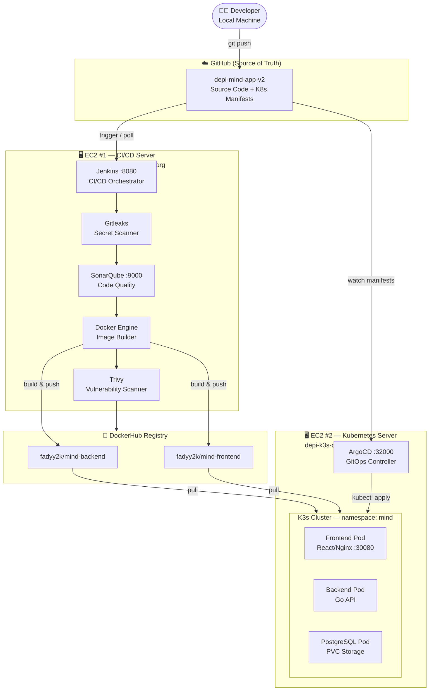
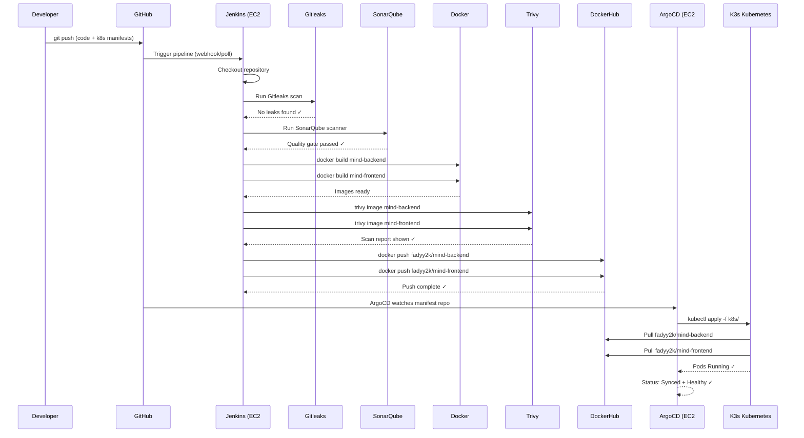

# Architecture

This page explains the full infrastructure design: the two AWS EC2 servers, how they interconnect, and the role of every component.

---

## High-Level Architecture Diagram



---

## Sequence Diagram — Full Pipeline Run



---

## EC2 #1 — CI/CD Server

**Hostname:** `depi-jenkins-depi.duckdns.org`
**Role:** All CI/CD and security scanning workloads.

### Services Running

| Service | Port | Purpose |
|---|---|---|
| **Jenkins** | 8080 | Pipeline orchestrator. Runs all stages: checkout, scan, build, push |
| **SonarQube** | 9000 | Static code analysis server. Receives scanner results and applies quality gate |
| **Docker Engine** | — | Builds backend and frontend container images |
| **Gitleaks** | — | Runs inside a Docker container (`ghcr.io/gitleaks/gitleaks:latest`). Scans repository for leaked secrets |
| **Trivy** | — | Scans built Docker images for CVE vulnerabilities before pushing to registry |

### Jenkins Credentials (stored securely — never in code)

| Credential ID | Type | Used For |
|---|---|---|
| `dockerhub-creds` | Username + Password | Push images to DockerHub |
| `github-creds` | Username + Token | Pull source code from GitHub |
| `sonarqube-token` | Secret Text | Authenticate SonarQube scanner |

!!! warning "Security"
    No credential values are stored in source code, YAML manifests, or documentation. All secrets are injected at runtime by Jenkins from its encrypted credentials store.

---

## EC2 #2 — Kubernetes / GitOps Server

**Hostname:** `depi-k3s-depi.duckdns.org`
**Role:** Container runtime, GitOps controller, and public app hosting.

### Services Running

| Service | Port | Purpose |
|---|---|---|
| **K3s Kubernetes** | 6443 (internal API) | Lightweight Kubernetes cluster running all app workloads |
| **ArgoCD** | 32000 (NodePort) | GitOps controller. Watches GitHub, syncs manifests to cluster |
| **MIND Frontend** | 30080 (NodePort) | React/Nginx app. Publicly accessible |
| **MIND Backend** | (internal ClusterIP) | Go API. Serves `/api/health` and all note operations |
| **PostgreSQL** | (internal ClusterIP) | Persistent database with PVC storage |

### Kubernetes Namespaces

| Namespace | Contents |
|---|---|
| `mind` | Frontend, backend, PostgreSQL, all services, PVC, secrets |
| `argocd` | ArgoCD controller and application definition |

---

## Networking and DuckDNS

Both EC2 instances use **DuckDNS** for stable, human-readable hostnames that map to their dynamic public IPs.

| Hostname | Resolves To | Used For |
|---|---|---|
| `depi-jenkins-depi.duckdns.org` | EC2 #1 Public IP | Jenkins (8080), SonarQube (9000) |
| `depi-k3s-depi.duckdns.org` | EC2 #2 Public IP | MIND App (30080), ArgoCD (32000) |

---

## DockerHub as the Bridge

DockerHub acts as the **shared image registry** connecting EC2 #1 (build) to EC2 #2 (runtime).

```
EC2 #1 Jenkins                DockerHub                EC2 #2 K3s
─────────────    push →    ──────────────    ← pull    ────────────
Docker build   ─────────▶  fadyy2k/mind-   ─────────▶  Pod runs
(CI/CD server)              backend:8        (K3s node)
                            frontend:8
```

The image tag is the Jenkins build number. This creates an immutable, traceable artifact for every pipeline run.

---

## Application Stack

| Component | Technology | Docker Image |
|---|---|---|
| **Frontend** | React + Nginx | `fadyy2k/mind-frontend` |
| **Backend** | Go REST API | `fadyy2k/mind-backend` |
| **Database** | PostgreSQL 15 | `postgres:15` |

### Local Development

Both `docker-compose.yml` and `docker-compose.dev.yml` are provided for local development without Kubernetes:

```bash
docker compose up           # Full stack
docker compose -f docker-compose.dev.yml up  # Dev mode with hot-reload
```

---

## GitHub as the Source of Truth

The repository holds two critical things:

1. **Application source code** — `MIND/backend/` and `MIND/frontend/`
2. **Kubernetes manifests** — `k8s/` directory

ArgoCD watches the `k8s/` directory in GitHub. Any change pushed to Git is automatically synced to the cluster. No manual `kubectl apply` is needed for deployments — **Git is the deployment mechanism**.
