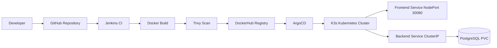

# Architecture

## High-Level Architecture

## AWS Servers

| Server | Purpose | Access |
|---|---|---|
| depi-jenkins-server | Jenkins CI | http://depi-jenkins-depi.duckdns.org:8080 |
| depi-k3s-server | K3s + ArgoCD + App | http://depi-k3s-depi.duckdns.org |

## Networking

| Port | Purpose |
|---:|---|
| 22 | SSH |
| 80 | HTTP |
| 443 | HTTPS |
| 6443 | Kubernetes API |
| 30080 | MIND App NodePort |
| 32000 | ArgoCD NodePort |
| 8080 | Jenkins |
