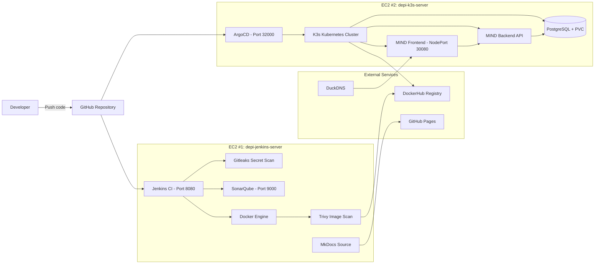
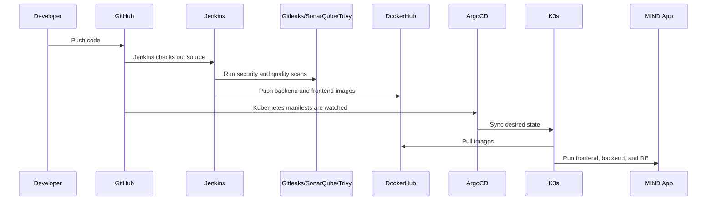

# Architecture

  
Infrastructure Design

  <h1>Two-EC2 DevSecOps architecture</h1>
  

    The project uses one EC2 server for CI/CD and scanning, and a second EC2 server
    for the production-like Kubernetes runtime.
  

## High-Level Design

## EC2 #1 — Jenkins Server

  
<h3>Jenkins</h3>
Runs the CI pipeline and coordinates the DevSecOps workflow.

  
<h3>Docker Engine</h3>
Builds backend and frontend images.

  
<h3>Gitleaks</h3>
Checks the repository for leaked credentials.

  
<h3>SonarQube</h3>
Provides static code analysis and quality gate visibility.

  
<h3>Trivy</h3>
Scans Docker images for vulnerabilities.

  
<h3>DuckDNS updater</h3>
Keeps Jenkins demo URL stable after EC2 public IP changes.

## EC2 #2 — K3s Server

  
<h3>K3s</h3>
Lightweight Kubernetes cluster for the application runtime.

  
<h3>ArgoCD</h3>
GitOps deployment, sync, prune, and self-healing.

  
<h3>Frontend</h3>
React app served through Nginx and exposed through NodePort.

  
<h3>Backend</h3>
Go API with health endpoint.

  
<h3>PostgreSQL</h3>
Database pod with persistent volume claim.

  
<h3>DuckDNS updater</h3>
Keeps app and ArgoCD demo URLs stable.

## Why this design is good for the demo

| Design Choice | Reason |
|---|---|
| Separate Jenkins and K3s EC2 servers | Keeps CI/CD workload separate from runtime workload |
| DockerHub registry | Allows Kubernetes to pull built images independently |
| ArgoCD GitOps | Makes Git the source of truth |
| DuckDNS | Avoids broken documentation links after EC2 IP changes |
| K3s | Lightweight, cost-effective Kubernetes for lab/demo |
| PostgreSQL PVC | Demonstrates persistence in Kubernetes |

## Data Flow

