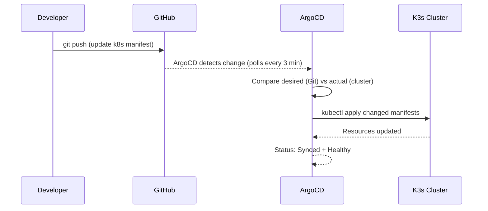
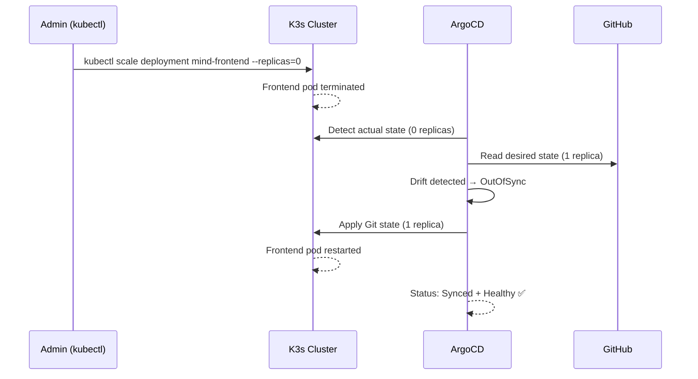

# ArgoCD GitOps

ArgoCD is the GitOps controller for this project. It watches the GitHub repository and automatically synchronizes the desired state defined in `k8s/` manifests into the K3s Kubernetes cluster.

---

## What Is GitOps?

GitOps is an operational model where:

1. **Git is the single source of truth** for the desired system state
2. Changes to the running system happen **only through Git commits**
3. An automated controller continuously **reconciles** the actual state to match Git
4. Any manual changes (drift) are **automatically corrected**

This means: to deploy a new version, you update a manifest in Git. ArgoCD does the rest.

---

## ArgoCD Access

| Field | Value |
|---|---|
| URL | [http://depi-k3s-depi.duckdns.org:32000](http://depi-k3s-depi.duckdns.org:32000) |
| Credentials | Demo credentials — live demo only |
| Application name | `mind-app` |

---

## ArgoCD Application — `mind-app`

The ArgoCD Application manifest tells ArgoCD what to watch and where to deploy:

```yaml
apiVersion: argoproj.io/v1alpha1
kind: Application
metadata:
  name: mind-app
  namespace: argocd
spec:
  project: default
  source:
    repoURL: https://github.com/fadyy2k/depi-mind-app-v2
    targetRevision: main
    path: k8s
  destination:
    server: https://kubernetes.default.svc
    namespace: mind
  syncPolicy:
    automated:
      prune: true
      selfHeal: true
```

| Field | Value |
|---|---|
| Source | GitHub repo `k8s/` directory |
| Branch | `main` |
| Target cluster | K3s (local) |
| Target namespace | `mind` |
| Auto-sync | Enabled |
| Self-heal | Enabled |
| Prune | Enabled |

---

## Application Status

| Field | Status |
|---|---|
| Sync Status | **Synced** |
| Health Status | **Healthy** |
| Repository | Watching `k8s/` on `main` |

**Synced** means the cluster state matches the Git-declared desired state exactly.
**Healthy** means all deployed resources (pods, services, PVC) are running and passing their health checks.

---

## How ArgoCD Works — Step by Step



ArgoCD polls the repository approximately every 3 minutes by default. Webhooks can be configured for instant sync.

---

## Self-Healing — Proof and Validation

### What Is Self-Healing?

Self-healing means ArgoCD detects and corrects any manual change to the cluster that deviates from what is declared in Git. This is one of the most important GitOps guarantees: **the cluster always converges to the Git state**.

### The Test

To prove self-healing works, the frontend deployment was manually scaled to zero replicas — simulating someone accidentally (or intentionally) changing the cluster outside of Git:

```bash
kubectl scale deployment mind-frontend -n mind --replicas=0
```

**Immediate effect:** The frontend pod terminated. The app became unavailable.

**ArgoCD response:**

1. ArgoCD detected that the cluster state (0 replicas) differed from Git (1 replica)
2. ArgoCD classified this as **OutOfSync**
3. Within approximately 90 seconds, ArgoCD applied the Git-declared state
4. The frontend deployment returned to 1 replica
5. The frontend pod restarted and returned to `1/1 Running`
6. ArgoCD status returned to **Synced** and **Healthy**

### Self-Healing Sequence



### Why This Matters

In a production environment, self-healing prevents:
- Accidental manual changes breaking the running application
- Drift accumulating over time that makes environments inconsistent
- Configuration differences between staging and production

Self-healing guarantees that Git — not individual engineers' kubectl commands — is always the authoritative runtime state.

---

## ArgoCD Manages These Resources

| Resource | Kind | Managed By |
|---|---|---|
| `mind` | Namespace | ArgoCD |
| `mind-frontend` | Deployment | ArgoCD |
| `mind-backend` | Deployment | ArgoCD |
| `postgres` | Deployment | ArgoCD |
| `postgres-pvc` | PersistentVolumeClaim | ArgoCD |
| `postgres-secret` | Secret | ArgoCD |
| `mind-frontend-service` | Service | ArgoCD |
| `backend-service` | Service | ArgoCD |
| `postgres` | Service | ArgoCD |

---

## Drift Detection

ArgoCD continuously compares:
- **Desired state** — what the Git manifests declare
- **Actual state** — what is running in the cluster

| Git State | Cluster State | ArgoCD Action |
|---|---|---|
| 1 replica | 1 replica | ✅ Synced — no action |
| 1 replica | 0 replicas | ⚠️ Drift detected — restore to 1 |
| 1 replica | 2 replicas | ⚠️ Drift detected — scale back to 1 |
| New image tag | Old image tag | ⚠️ Drift detected — rolling update |

---

## ArgoCD vs Manual kubectl

| Approach | Manual kubectl | ArgoCD GitOps |
|---|---|---|
| Deployment trigger | Human runs command | Git commit |
| Audit trail | None (or logs only) | Full Git history |
| Drift correction | Manual | Automatic |
| Rollback | Manual | `git revert` + auto-sync |
| Multi-cluster | Error-prone | Declarative, consistent |
| Collaboration | Risky | PR-based review process |

---

## Production ArgoCD Improvements

| Current | Production Target |
|---|---|
| HTTP only | HTTPS with TLS |
| Single cluster | Multi-cluster application management |
| Git polling | GitHub webhook for instant sync |
| Default project | RBAC with multiple projects and teams |
| Admin login | SSO integration (Okta, GitHub OIDC) |
| Manual image tag | Image updater for automated tag bumping |
