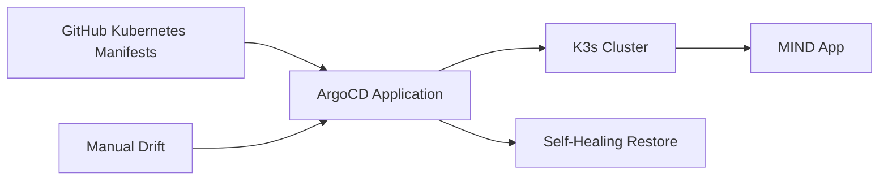

# ArgoCD GitOps

<div class="depi-hero">
  <div class="depi-eyebrow">GitOps Delivery</div>
  <h1>ArgoCD keeps Kubernetes synced with Git</h1>
  <p>
    ArgoCD watches the GitHub repository and applies the Kubernetes manifests to the K3s cluster.
  </p>
</div>

## GitOps Flow



## ArgoCD Settings

| Setting | Value |
|---|---|
| Sync | Automated |
| Prune | Enabled |
| Self-heal | Enabled |
| Target cluster | K3s server |
| Application status | Synced / Healthy |

## Self-Healing Test

A live drift test was performed:

```bash
kubectl scale deployment mind-frontend -n mind --replicas=0
```

ArgoCD detected that the live cluster no longer matched the Git desired state and restored the frontend deployment.

## Result

| Resource | Result |
|---|---|
| `mind-frontend` | Restored to `1/1 Running` |
| `mind-app` | Synced / Healthy |

!!! success "GitOps proof"
    This proves Git is the source of truth and ArgoCD can automatically repair unauthorized drift.
