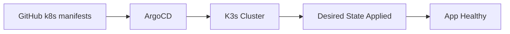

# ArgoCD GitOps

## ArgoCD Application

| Field | Value |
|---|---|
| Name | mind-app |
| Repo | https://github.com/fadyy2k/depi-mind-app-v2.git |
| Path | k8s |
| Branch | main |
| Namespace | mind |
| Sync | Automated |
| Prune | Enabled |
| Self-Heal | Enabled |

## GitOps Flow



## Self-Healing Test

Manual drift was created with:

```bash
kubectl scale deployment mind-frontend -n mind --replicas=0
```

ArgoCD restored the desired state automatically.

Final status:

- mind-frontend: 1/1 Running
- mind-app: Synced / Healthy
