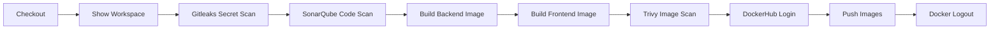

# CI/CD Pipeline

  
Continuous Integration

  <h1>Jenkins pipeline with DevSecOps checks</h1>
  

    Jenkins automates checkout, workspace validation, secret scanning, code quality scanning,
    Docker image builds, image scanning, and DockerHub publishing.
  

## Pipeline Flow

## Pipeline Stages

| Stage | Tool | Purpose |
|---|---|---|
| Checkout | Jenkins/Git | Pull repository source |
| Show Workspace | Shell | Validate folder structure |
| Gitleaks Secret Scan | Gitleaks | Detect leaked secrets |
| SonarQube Code Scan | SonarQube | Analyze code quality |
| Build Backend Image | Docker | Build Go backend image |
| Build Frontend Image | Docker | Build React/Nginx frontend image |
| Trivy Image Scan | Trivy | Scan image vulnerabilities |
| DockerHub Login | Docker | Authenticate with registry |
| Push Images | DockerHub | Publish versioned images |
| Docker Logout | Docker | Cleanup registry session |

!!! info "Why Jenkins?"
    Jenkins is used as the central CI orchestrator because it clearly shows each stage of the DevSecOps pipeline and integrates easily with Docker-based scanning tools.

## Image Tagging Strategy

| Image | Repository |
|---|---|
| Backend | `fadyy2k/mind-backend` |
| Frontend | `fadyy2k/mind-frontend` |

The pipeline can push both `latest` and versioned build tags, making it easier to track what was deployed.

## Evidence

Open the screenshots page to see Jenkins dashboard, successful builds, Gitleaks console, SonarQube console, Trivy console, and DockerHub image evidence.
