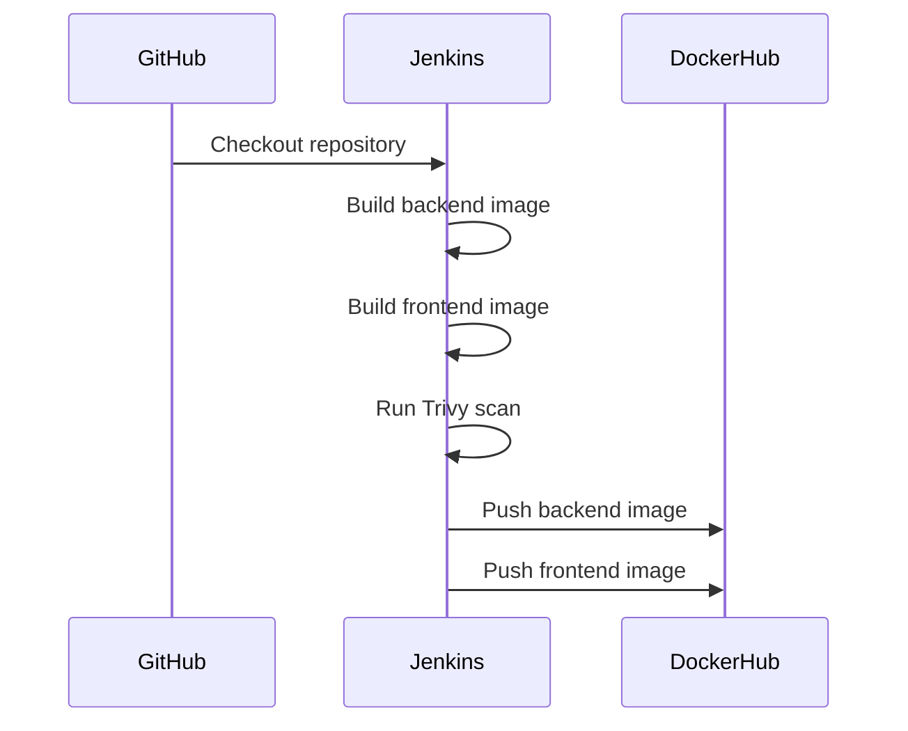

# CI/CD Pipeline

## Jenkins Job

Job name: `depi-mind-app-ci`

## Pipeline Stages

1. Checkout
2. Show Workspace
3. Build Backend Image
4. Build Frontend Image
5. Trivy Image Scan
6. DockerHub Login
7. Push Images
8. Docker Logout

## Flow

## Docker Images

| Image | Tags |
|---|---|
| fadyy2k/mind-backend | 1, 2, 3, latest |
| fadyy2k/mind-frontend | 1, 2, 3, latest |
