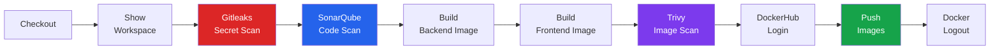

# CI/CD Pipeline

The Jenkins pipeline automates every step from source code to a pushed, scanned, production-ready Docker image. This page explains each stage, what it does, and why it matters.

---

## Pipeline Overview



---

## Jenkins Access

| Item | Value |
|---|---|
| Jenkins URL | [http://depi-jenkins-depi.duckdns.org:8080](http://depi-jenkins-depi.duckdns.org:8080) |
| Login | No login required (read-only public view) |
| Pipeline job | Visible in the Jenkins dashboard |

---

## Pipeline Stages — Detailed Walkthrough

### Stage 1: Checkout

**Purpose:** Pull the latest source code from GitHub.

Jenkins clones the repository using the `github-creds` credential stored in Jenkins. This ensures the build always runs against the latest committed code.

**Why it matters:** The entire pipeline depends on having a clean, verified copy of the repository. Jenkins does not use cached or stale code.

---

### Stage 2: Show Workspace

**Purpose:** Validate repository structure and display the file tree.

This stage prints the workspace contents to the Jenkins console. It confirms that the correct files are present before any scanning or building begins.

**Why it matters:** Provides immediate visibility if a checkout is incomplete or missing expected files.

---

### Stage 3: Gitleaks Secret Scan

**Purpose:** Scan the entire repository for leaked secrets, credentials, tokens, or private keys before any build occurs.

**Implementation:**

```groovy
sh '''
docker run --rm -v ${WORKSPACE}:/path \
  ghcr.io/gitleaks/gitleaks:latest detect \
  --source=/path \
  --verbose \
  --exit-code=0 \
  --report-path=/path/gitleaks-reports/gitleaks-console-report.txt
'''
```

Gitleaks runs inside a Docker container using the official image from GitHub Container Registry. The scan output is saved to:

```
gitleaks-reports/gitleaks-console-report.txt
```

**Result:** No leaks found ✓

**Exit code behavior:** `--exit-code=0` allows the pipeline to continue and log the result. In production this should be removed so the pipeline fails immediately on any leak detection.

---

### Stage 4: SonarQube Code Scan

**Purpose:** Perform static code analysis across the backend (Go) and frontend (React) source code.

**Implementation:**

```groovy
sh '''
docker run --rm \
  -e SONAR_HOST_URL=http://${SONAR_HOST} \
  -e SONAR_LOGIN=${SONAR_TOKEN} \
  -v ${WORKSPACE}:/usr/src \
  sonarsource/sonar-scanner-cli:latest \
  -Dsonar.projectKey=depi-mind-app-v2 \
  -Dsonar.projectName="DEPI MIND App" \
  -Dsonar.sources=MIND/backend,MIND/frontend
'''
```

The scanner runs inside Docker and connects to the SonarQube server running on the same EC2 at `localhost:9000`.

**SonarQube project details:**

| Field | Value |
|---|---|
| Project Key | `depi-mind-app-v2` |
| Project Name | `DEPI MIND App` |
| Sources | `MIND/backend`, `MIND/frontend` |
| Server | `http://localhost:9000` (EC2 #1 internal) |

**Result:** Project created, analysis uploaded, quality gate passed ✓

---

### Stage 5: Build Backend Image

**Purpose:** Build the backend Go API Docker image.

```bash
docker build -t fadyy2k/mind-backend ./MIND/backend
```

**Image:** `fadyy2k/mind-backend:latest` and tagged with Jenkins build number.

---

### Stage 6: Build Frontend Image

**Purpose:** Build the frontend React/Nginx Docker image.

```bash
docker build -t fadyy2k/mind-frontend ./MIND/frontend
```

**Image:** `fadyy2k/mind-frontend:latest` and tagged with Jenkins build number.

---

### Stage 7: Trivy Image Scan

**Purpose:** Scan both Docker images for known CVE vulnerabilities before they are pushed to DockerHub.

```groovy
sh 'trivy image --exit-code 0 --severity HIGH,CRITICAL fadyy2k/mind-backend'
sh 'trivy image --exit-code 0 --severity HIGH,CRITICAL fadyy2k/mind-frontend'
```

**Mode:** Report-only (`--exit-code 0`) — the scan runs and shows results but does not block the pipeline.

**Demo rationale:** For the purposes of this demonstration, the goal is to show that vulnerability scanning is integrated into the pipeline and that results are visible and logged. Blocking builds requires tuning acceptable risk thresholds for a specific production context.

**Production target:** Remove `--exit-code 0` so the pipeline fails on any HIGH or CRITICAL vulnerability that lacks an accepted exception.

**Result:** Trivy scan output shown in Jenkins console ✓

---

### Stage 8: DockerHub Login

**Purpose:** Authenticate to DockerHub using Jenkins-managed credentials before pushing images.

```groovy
withCredentials([usernamePassword(
    credentialsId: 'dockerhub-creds',
    usernameVariable: 'DOCKER_USER',
    passwordVariable: 'DOCKER_PASS'
)]) {
    sh 'echo $DOCKER_PASS | docker login -u $DOCKER_USER --password-stdin'
}
```

**Security:** Credentials are injected from Jenkins at runtime. The password is never printed to logs.

---

### Stage 9: Push Images

**Purpose:** Push the built and scanned images to DockerHub so K3s can pull them.

```bash
docker push fadyy2k/mind-backend
docker push fadyy2k/mind-frontend
```

**Tags pushed:** `latest` and the Jenkins build number (e.g., `8`, `9`, `10`).

**Result:** Images available at:

- [https://hub.docker.com/r/fadyy2k/mind-backend](https://hub.docker.com/r/fadyy2k/mind-backend)
- [https://hub.docker.com/r/fadyy2k/mind-frontend](https://hub.docker.com/r/fadyy2k/mind-frontend)

---

### Stage 10: Docker Logout

**Purpose:** Remove the DockerHub session from the build server.

```bash
docker logout
```

**Why it matters:** Prevents credential reuse if the build agent is compromised or shared. Always clean up authentication sessions after use.

---

## Jenkins Credentials

All secrets used by the pipeline are stored in Jenkins Credentials Manager. **No credential value exists in any file in this repository.**

| Credential ID | Type | Used In Stage |
|---|---|---|
| `github-creds` | Username + Token | Checkout |
| `sonarqube-token` | Secret Text | SonarQube Scan |
| `dockerhub-creds` | Username + Password | DockerHub Login + Push |

---

## Pipeline Artifacts

| Artifact | Location | Contents |
|---|---|---|
| Gitleaks report | `gitleaks-reports/gitleaks-console-report.txt` | Secret scan result |
| Trivy output | Jenkins console log | Vulnerability scan report |
| Docker images | DockerHub | `mind-backend`, `mind-frontend` |

---

## Build History

The pipeline has been run multiple times. Build #8 was the final successful build that included both Gitleaks and SonarQube integration. Evidence is shown in the [Screenshots](screenshots.md) section.

---

## What Triggers the Pipeline?

Jenkins is configured to poll GitHub or receive webhook events. Any push to the repository triggers a fresh pipeline run from Stage 1 through Stage 10.

---

## Production Pipeline Improvements

| Item | Current | Production Target |
|---|---|---|
| Trivy exit code | `0` (report only) | `1` (fail on HIGH/CRITICAL) |
| Gitleaks exit code | `0` | `1` (fail on any leak) |
| Image tagging | Build number + latest | Semantic version + Git SHA |
| Notifications | None | Slack/email on failure |
| Test stage | None | Unit + integration tests before build |
| SBOM | None | Syft SBOM generation per image |
