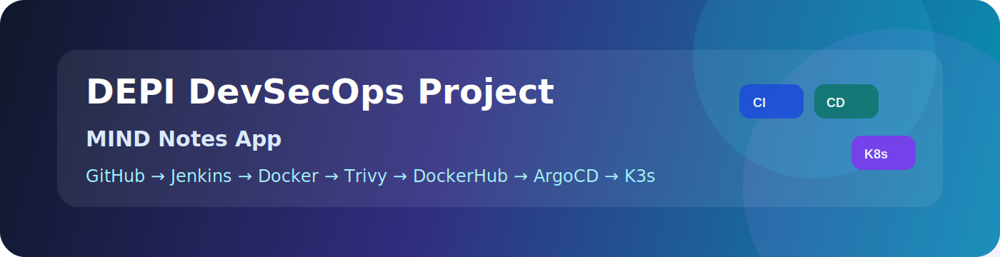

# DEPI DevSecOps Project — MIND Notes App

## Project Demo Links

| Service | URL | Access / Login Info |
|---|---|---|
| GitHub Repository | https://github.com/fadyy2k/depi-mind-app-v2 | Public repository |
| Live Documentation | https://fadyy2k.github.io/depi-mind-app-v2/ | Public documentation |
| Jenkins | http://depi-jenkins-depi.duckdns.org:8080 | No login required |
| MIND App | http://depi-k3s-depi.duckdns.org:30080 | Email: `demo@example.com` / Password: `demo123456` |
| API Health | http://depi-k3s-depi.duckdns.org:30080/api/health | Public health endpoint |
| ArgoCD | http://depi-k3s-depi.duckdns.org:32000 | Username: `admin` / Password provided privately during demo |
| DockerHub Backend | https://hub.docker.com/r/fadyy2k/mind-backend | Public image repository |
| DockerHub Frontend | https://hub.docker.com/r/fadyy2k/mind-frontend | Public image repository |

> Security note: ArgoCD admin credentials are intentionally not stored in this public repository.

---
## Overview

This documentation explains the complete DEPI DevSecOps project built on AWS using Jenkins, Gitleaks, SonarQube, Docker, Trivy, DockerHub, K3s Kubernetes, and ArgoCD GitOps.

## Live Services

| Service | URL |
|---|---|
| Jenkins | http://depi-jenkins-depi.duckdns.org:8080 |
| MIND App | http://depi-k3s-depi.duckdns.org:30080 |
| API Health | http://depi-k3s-depi.duckdns.org:30080/api/health |
| ArgoCD | http://depi-k3s-depi.duckdns.org:32000 |

## Application Stack

| Layer | Technology |
|---|---|
| Frontend | React + Nginx |
| Backend | Go API |
| Database | PostgreSQL |
| CI | Jenkins |
| Registry | DockerHub |
| Security | Gitleaks, SonarQube, Trivy |
| Kubernetes | K3s |
| GitOps | ArgoCD |
| DNS | DuckDNS |

## Final Result

- K3s node is Ready
- Backend pod is Running
- Frontend pod is Running
- PostgreSQL pod is Running
- ArgoCD app is Synced and Healthy
- API health returns 200 OK
