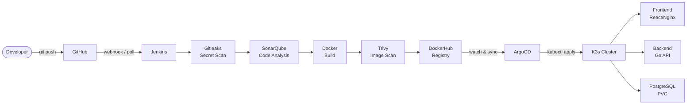

# DEPI DevSecOps Project — MIND Notes App

!!! success "Live and Running"
    The full pipeline is deployed and active. All services are reachable at the links below.

---

## What Is This Project?

This is a complete **DevSecOps implementation** for the MIND Notes App — a full-stack note-taking application consisting of a React frontend, a Go backend API, and a PostgreSQL database.

The project demonstrates the entire modern DevSecOps lifecycle:

- Developers push code to **GitHub**
- **Jenkins** automatically triggers the CI/CD pipeline
- **Gitleaks** scans for leaked secrets before anything is built
- **SonarQube** performs static code analysis and quality gate validation
- **Docker** builds versioned container images for the frontend and backend
- **Trivy** scans those images for known CVE vulnerabilities
- Images are published to **DockerHub** as versioned artifacts
- **ArgoCD** detects the new image and syncs the Kubernetes manifests
- **K3s** deploys and runs the application on EC2
- The app is publicly reachable with a health-checked API

Every stage is automated, logged, and evidenced with screenshots.

---

## Live Access

| Resource | URL | Credentials |
|---|---|---|
| MIND Notes App | [http://depi-k3s-depi.duckdns.org:30080](http://depi-k3s-depi.duckdns.org:30080) | `demo@example.com` / `demo123456` |
| API Health | [http://depi-k3s-depi.duckdns.org:30080/api/health](http://depi-k3s-depi.duckdns.org:30080/api/health) | Public |
| Jenkins | [http://depi-jenkins-depi.duckdns.org:8080](http://depi-jenkins-depi.duckdns.org:8080) | No login required |
| ArgoCD | [http://depi-k3s-depi.duckdns.org:32000](http://depi-k3s-depi.duckdns.org:32000) | Demo credentials — live demo only |
| SonarQube | [http://depi-jenkins-depi.duckdns.org:9000](http://depi-jenkins-depi.duckdns.org:9000) | Demo credentials — live demo only |
| DockerHub (backend) | [fadyy2k/mind-backend](https://hub.docker.com/r/fadyy2k/mind-backend) | Public |
| DockerHub (frontend) | [fadyy2k/mind-frontend](https://hub.docker.com/r/fadyy2k/mind-frontend) | Public |

---

## The Complete Pipeline

---

## DevSecOps Toolchain

| Tool | Category | What It Does |
|---|---|---|
| **Jenkins** | CI/CD | Orchestrates all pipeline stages automatically |
| **Gitleaks** | Secret Scanning | Detects leaked credentials in source code |
| **SonarQube** | Code Quality | Static analysis, bugs, code smells, quality gate |
| **Trivy** | Vulnerability Scanning | Scans Docker images for known CVEs |
| **Docker** | Containerization | Builds and packages images |
| **DockerHub** | Registry | Stores and versions container images |
| **K3s** | Kubernetes | Lightweight container orchestration runtime |
| **ArgoCD** | GitOps | Declarative, self-healing continuous deployment |
| **GitHub Actions** | Pages Deployment | Builds and deploys docs + showcase |
| **MkDocs Material** | Documentation | This documentation portal |

---

## Infrastructure Summary

Two AWS EC2 instances power this project:

=== "EC2 #1 — CI/CD Server"
    **Hostname:** `depi-jenkins-depi.duckdns.org`

    - Jenkins (port 8080)
    - SonarQube (port 9000)
    - Docker Engine
    - Gitleaks (Docker-based)
    - Trivy

=== "EC2 #2 — Kubernetes Server"
    **Hostname:** `depi-k3s-depi.duckdns.org`

    - K3s Kubernetes Cluster
    - ArgoCD (port 32000)
    - MIND App (port 30080)
    - PostgreSQL with persistent storage

---

## Navigate the Documentation

-   :material-sitemap: **[Architecture](architecture.md)**

    Two EC2 servers, full infrastructure diagrams, DuckDNS networking

-   :material-pipe: **[CI/CD Pipeline](cicd.md)**

    Jenkins stages, Jenkinsfile walkthrough, pipeline screenshots

-   :material-shield-check: **[Security Scanning](security.md)**

    Gitleaks, SonarQube, Trivy — tools and results

-   :material-kubernetes: **[Kubernetes](kubernetes.md)**

    K3s cluster, namespace, pods, services, PVC, NodePort

-   :material-sync: **[ArgoCD GitOps](argocd.md)**

    Sync, health, drift detection, self-healing proof

-   :material-wrench: **[Operations](operations.md)**

    Commands, troubleshooting, deployment validation

-   :material-image: **[Screenshots](screenshots.md)**

    Full evidence gallery — all stages documented

-   :material-school: **[Professor Q&A](professor-qa.md)**

    Likely questions with clear, confident answers

