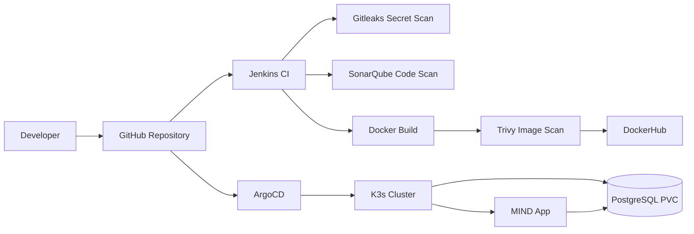

# DEPI DevSecOps Project — MIND Notes App

  
AWS • Jenkins • DevSecOps • Kubernetes • GitOps

  <h1>Production-style DevSecOps pipeline for the MIND Notes App</h1>
  

    A complete end-to-end project showing source control, CI automation, secret scanning,
    code quality, Docker image builds, image vulnerability scanning, registry publishing,
    K3s Kubernetes deployment, and ArgoCD GitOps self-healing.
  

  

    <a class="depi-button primary" href="showcase/">Open Visual Showcase</a>
    <a class="depi-button" href="screenshots/">View Evidence Screenshots</a>
    <a class="depi-button" href="https://github.com/fadyy2k/depi-mind-app-v2" target="_blank">GitHub Repository</a>
  

## Project Demo Links

| Service | URL | Access |
|---|---|---|
| GitHub Repository | https://github.com/fadyy2k/depi-mind-app-v2 | Public |
| Visual Showcase | https://fadyy2k.github.io/depi-mind-app-v2/showcase/ | Public |
| Jenkins | http://depi-jenkins-depi.duckdns.org:8080 | No login required |
| MIND App | http://depi-k3s-depi.duckdns.org:30080 | `demo@example.com` / `demo123456` |
| API Health | http://depi-k3s-depi.duckdns.org:30080/api/health | Public |
| ArgoCD | http://depi-k3s-depi.duckdns.org:32000 | Demo credentials only |
| SonarQube | http://depi-jenkins-depi.duckdns.org:9000 | Demo credentials only |
| DockerHub Backend | https://hub.docker.com/r/fadyy2k/mind-backend | Public |
| DockerHub Frontend | https://hub.docker.com/r/fadyy2k/mind-frontend | Public |

!!! warning "Security note"
    Do not store admin passwords, GitHub tokens, DockerHub tokens, SSH keys, `.pem` files, or cloud credentials in public repositories or public documentation.

## Executive Summary

  

    
2

    <h3>AWS EC2 Servers</h3>
    
Separated CI/CD and Kubernetes runtime environments.

  

  

    
10

    <h3>Pipeline Stages</h3>
    
Checkout, scans, builds, image push, and cleanup.

  

  

    
3

    <h3>Security Gates</h3>
    
Gitleaks, SonarQube, and Trivy integrated in CI.

  

  

    
100%

    <h3>GitOps Proof</h3>
    
ArgoCD restored the application after manual drift.

  

## Final Toolchain

  GitHub<b>→</b>
  Jenkins<b>→</b>
  Gitleaks<b>→</b>
  SonarQube<b>→</b>
  Docker Build<b>→</b>
  Trivy<b>→</b>
  DockerHub<b>→</b>
  ArgoCD<b>→</b>
  K3s<b>→</b>
  MIND App

## What the project proves

- GitHub repository management for source code and Kubernetes manifests.
- Jenkins CI pipeline running on AWS EC2.
- Gitleaks secret scanning before Docker image builds.
- SonarQube static code quality scanning.
- Docker image build and publish workflow.
- Trivy image vulnerability visibility.
- K3s Kubernetes deployment on AWS EC2.
- PostgreSQL persistence using PVC.
- ArgoCD GitOps sync, prune, and self-healing.
- DuckDNS stable demo URLs for EC2 public IP changes.

## Demo Flow for Presentation

1. Open the **Visual Showcase**.
2. Open the **GitHub repository** and explain the source structure.
3. Show the **Jenkins pipeline** and successful build.
4. Show **Gitleaks** no-leaks evidence.
5. Show **SonarQube** quality gate evidence.
6. Show **Trivy** vulnerability scan evidence.
7. Show **DockerHub** backend and frontend images.
8. Show **K3s pods/services** running.
9. Show **ArgoCD Synced/Healthy**.
10. Open the **MIND app** and API health endpoint.
11. Explain the **self-healing test**.

## Architecture Preview

## Recommended reading

Use the navigation tabs for detailed pages:

- **Architecture** for EC2 and workflow diagrams.
- **CI/CD Pipeline** for Jenkins stages.
- **Security Scanning** for Gitleaks, SonarQube, and Trivy.
- **Kubernetes** for K3s runtime details.
- **ArgoCD GitOps** for sync and self-healing proof.
- **Screenshots** for evidence.
- **Professor Q&A** for quick answers during discussion.
