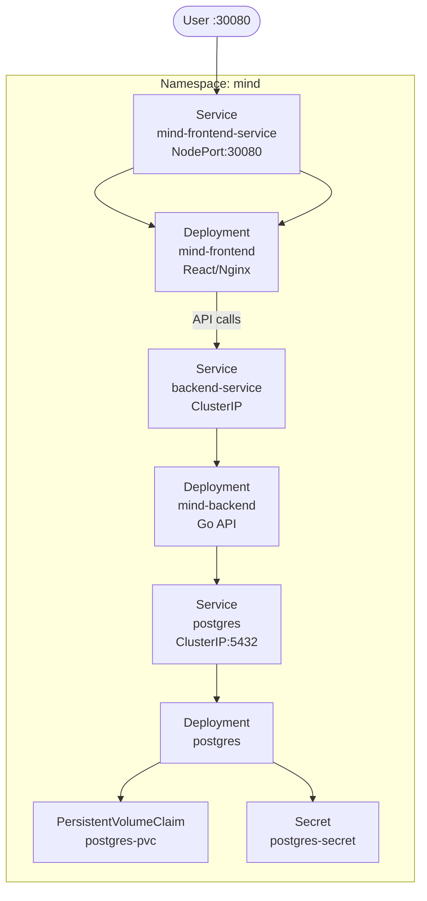

# Kubernetes

The MIND Notes App runs on a **K3s Kubernetes cluster** on EC2 #2. This page explains the cluster structure, all deployed resources, and how to validate the running application.

---

## Why K3s?

K3s is a certified, lightweight Kubernetes distribution maintained by Rancher/SUSE. It is ideal for:

- **Single-node or resource-constrained environments** (like a single EC2 instance)
- **Learning and demonstration** — same Kubernetes API, but without the overhead of full distributions
- **Fast setup** — installs in minutes, runs with minimal RAM/CPU

For production at scale, K3s would be replaced with a managed service (EKS, GKE, AKS) or a multi-node cluster. For this project, K3s provides a fully functional Kubernetes runtime that proves the deployment model works.

---

## Cluster Information

| Field | Value |
|---|---|
| Distribution | K3s |
| Server | EC2 #2 (`depi-k3s-server`) |
| Hostname | `depi-k3s-depi.duckdns.org` |
| Kubernetes API | Port 6443 (internal) |
| Node status | Ready |

---

## Namespaces

| Namespace | Purpose |
|---|---|
| `mind` | All MIND app workloads (frontend, backend, database) |
| `argocd` | ArgoCD GitOps controller and application definition |

---

## Kubernetes Resources — `mind` Namespace

### Deployments

| Deployment | Image | Replicas | Purpose |
|---|---|---|---|
| `mind-frontend` | `fadyy2k/mind-frontend` | 1 | React/Nginx frontend |
| `mind-backend` | `fadyy2k/mind-backend` | 1 | Go REST API |
| `postgres` | `postgres:15` | 1 | PostgreSQL 15 database |

### Services

| Service | Type | Port | Purpose |
|---|---|---|---|
| `mind-frontend-service` | NodePort | **30080** | Public frontend access |
| `backend-service` | ClusterIP | Internal | Backend API (internal) |
| `postgres` | ClusterIP | 5432 (internal) | Database access (internal) |

### Storage

| Resource | Type | Purpose |
|---|---|---|
| `postgres-pvc` | PersistentVolumeClaim | Database data persistence across pod restarts |

### Secrets

| Resource | Purpose |
|---|---|
| `postgres-secret` | PostgreSQL credentials (username, password, database name) |

!!! warning "Secret values"
    The `postgres-secret` Kubernetes Secret is base64-encoded in the manifest. This is **not encryption** — base64 is encoding only. For production, use Sealed Secrets, External Secrets Operator, or Vault Agent Injector to manage Kubernetes secrets properly.

---

## Resource Diagram



---

## NodePort — Public Access

The frontend is exposed via **NodePort 30080** on the EC2 #2 public IP:

```
http://depi-k3s-depi.duckdns.org:30080
```

NodePort is appropriate for this demo. In production, use an **Ingress controller** (e.g., Nginx Ingress or Traefik) with a domain, TLS certificate, and proper load balancing.

---

## Kubernetes Manifests

All manifests live in the `k8s/` directory of the repository. ArgoCD watches this directory and applies any changes automatically.

| File | Contents |
|---|---|
| `namespace.yaml` | Creates the `mind` namespace |
| `backend-deployment.yaml` | Backend Deployment + resource limits |
| `frontend-deployment.yaml` | Frontend Deployment + resource limits |
| `postgres-deployment.yaml` | PostgreSQL Deployment |
| `postgres-pvc.yaml` | PVC for PostgreSQL data |
| `postgres-secret.yaml` | Encoded DB credentials |
| `services.yaml` | All three Services |

---

## Validation Commands

```bash
# Check node status
kubectl get nodes -o wide

# Check all pods in mind namespace
kubectl get pods -n mind -o wide

# Check services
kubectl get svc -n mind

# Check PVC
kubectl get pvc -n mind

# Check ArgoCD application
kubectl get application mind-app -n argocd

# Check pod logs
kubectl logs -n mind deployment/mind-backend
kubectl logs -n mind deployment/mind-frontend
```

### Expected Output — Healthy Cluster

```
NAME   STATUS   ROLES         AGE
node   Ready    control-plane  Xd

NAME                         READY   STATUS    RESTARTS
mind-frontend-xxx            1/1     Running   0
mind-backend-xxx             1/1     Running   X
postgres-xxx                 1/1     Running   0

NAME                     TYPE        PORT(S)
mind-frontend-service    NodePort    80:30080/TCP
backend-service          ClusterIP   8080/TCP
postgres                 ClusterIP   5432/TCP
```

!!! note "Backend Restarts"
    The backend pod may show a non-zero restart count. This occurred during initial setup due to database connection timing. The pod recovered and is running stably. This is a known startup ordering issue that can be resolved with a proper `initContainer` or `livenessProbe` + `readinessProbe` configuration.

---

## API Health Validation

```bash
curl http://depi-k3s-depi.duckdns.org:30080/api/health
```

**Expected response:**

```json
{"message":"Notes API is running","status":"ok"}
```

This confirms:
- The frontend Nginx is serving and proxying correctly
- The Go backend is running and responding
- The NodePort routing is working

---

## PersistentVolumeClaim — Database Persistence

The PostgreSQL deployment uses a PVC to persist data:

```yaml
apiVersion: v1
kind: PersistentVolumeClaim
metadata:
  name: postgres-pvc
  namespace: mind
spec:
  accessModes:
    - ReadWriteOnce
  resources:
    requests:
      storage: 1Gi
```

K3s provides a built-in local-path storage provisioner that automatically satisfies PVC requests on the node. Data survives pod restarts and redeployments as long as the node is running.

---

## Production Kubernetes Improvements

| Current | Production Target |
|---|---|
| K3s single node | Multi-node cluster or managed EKS/GKE |
| NodePort | Ingress controller + TLS |
| Local-path PVC | Cloud-managed persistent volumes |
| No resource limits | CPU/memory requests and limits on all pods |
| No HPA | Horizontal Pod Autoscaler |
| No network policies | Kubernetes NetworkPolicy |
| Base64 secrets | Sealed Secrets or External Secrets Operator |
| No monitoring | Prometheus + Grafana stack |
