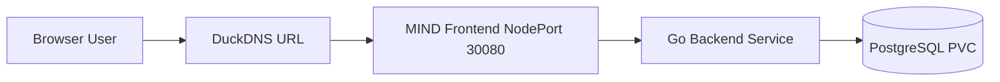

# Kubernetes Deployment

  
Runtime Platform

  <h1>K3s Kubernetes running the MIND App</h1>
  

    The application is deployed to a single-node K3s Kubernetes cluster running on AWS EC2.
  

## Runtime Components

| Component | Purpose |
|---|---|
| Namespace | Isolates MIND app resources |
| Frontend deployment | Runs React/Nginx frontend |
| Backend deployment | Runs Go API |
| PostgreSQL deployment | Runs database pod |
| PVC | Provides database persistence |
| Services | Expose frontend, backend, and database internally/publicly |

## Application Runtime Flow

## Final Validation

| Check | Final Status |
|---|---|
| K3s node | Ready |
| Backend pod | Running |
| Frontend pod | Running |
| PostgreSQL pod | Running |
| API health | 200 OK |
| Application URL | Reachable |

## Why K3s?

K3s is lightweight and suitable for a cost-controlled lab while still demonstrating real Kubernetes concepts: deployments, services, namespaces, persistent storage, and GitOps deployment.
