# Project Screenshots

This page contains visual proof of the complete DEPI DevSecOps workflow, from source code to CI/CD, security scanning, DockerHub publishing, Kubernetes deployment, ArgoCD GitOps, and self-healing validation.

---

## 1. GitHub Repository

The GitHub repository contains the application source code, Jenkins pipeline, Kubernetes manifests, MkDocs documentation, and GitHub Pages workflow.

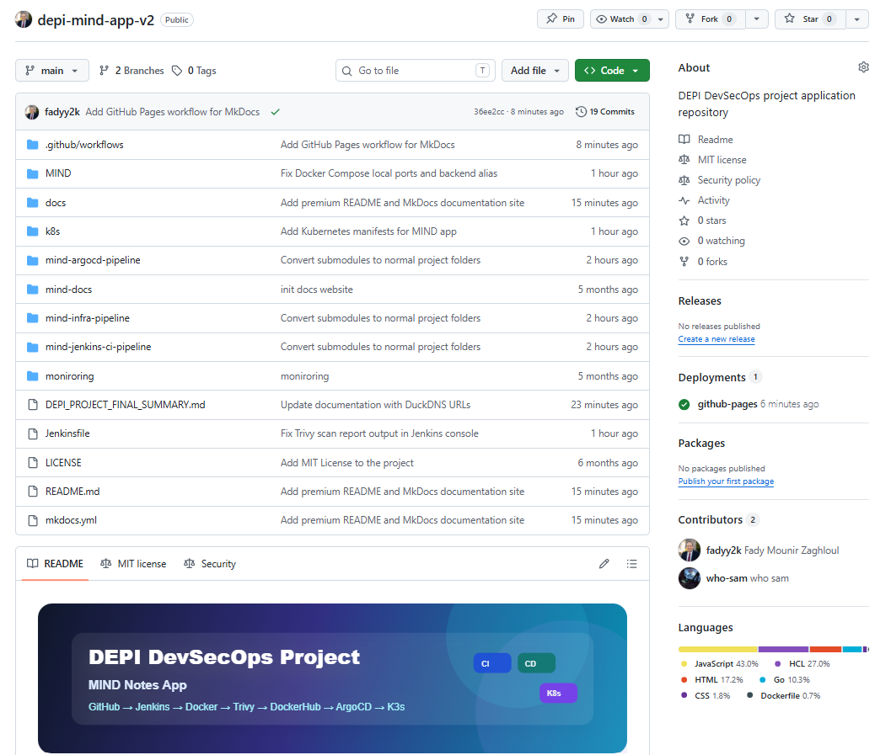

---

## 2. MkDocs Documentation Website

The project documentation is published using MkDocs Material and GitHub Pages.

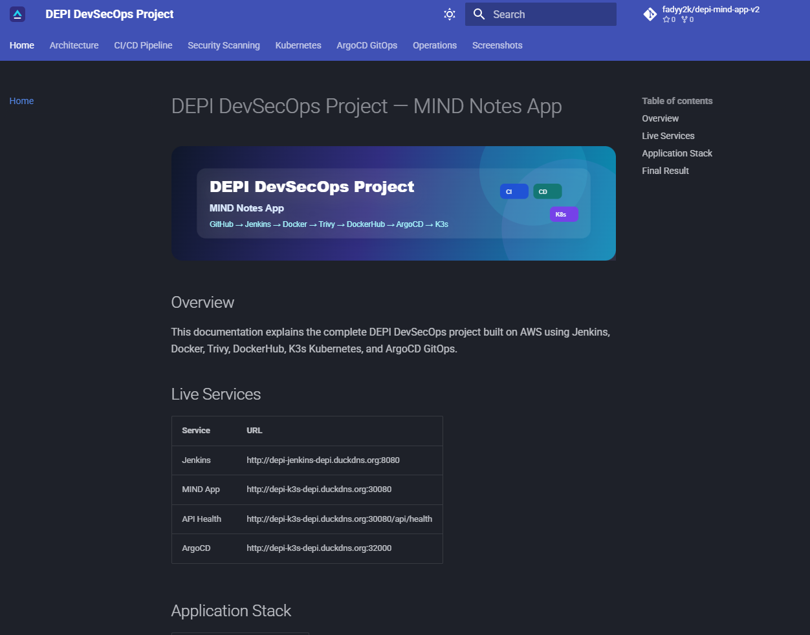

---

## 3. Jenkins Dashboard

Jenkins is running on AWS EC2 and contains the CI pipeline job for the MIND application.

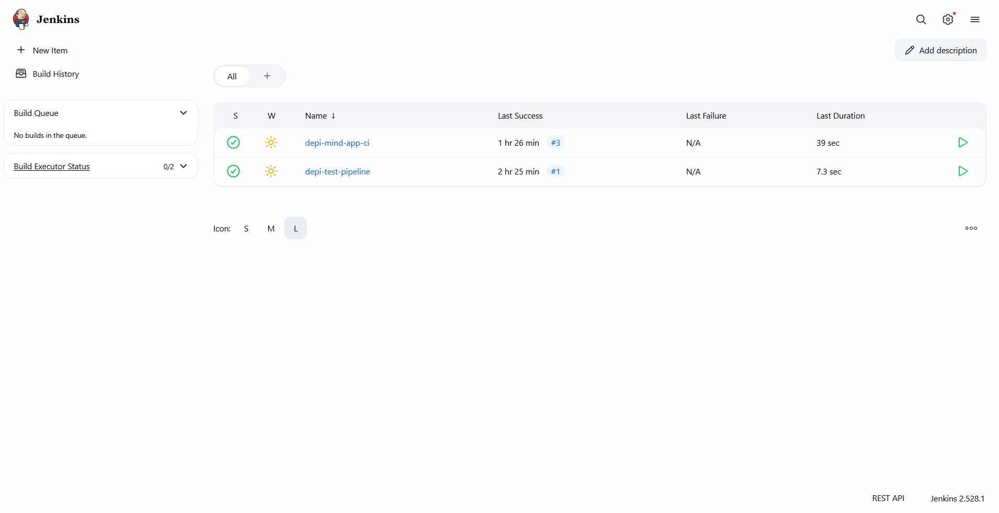

---

## 4. Jenkins Successful Build

The Jenkins pipeline completed successfully and pushed Docker images to DockerHub.

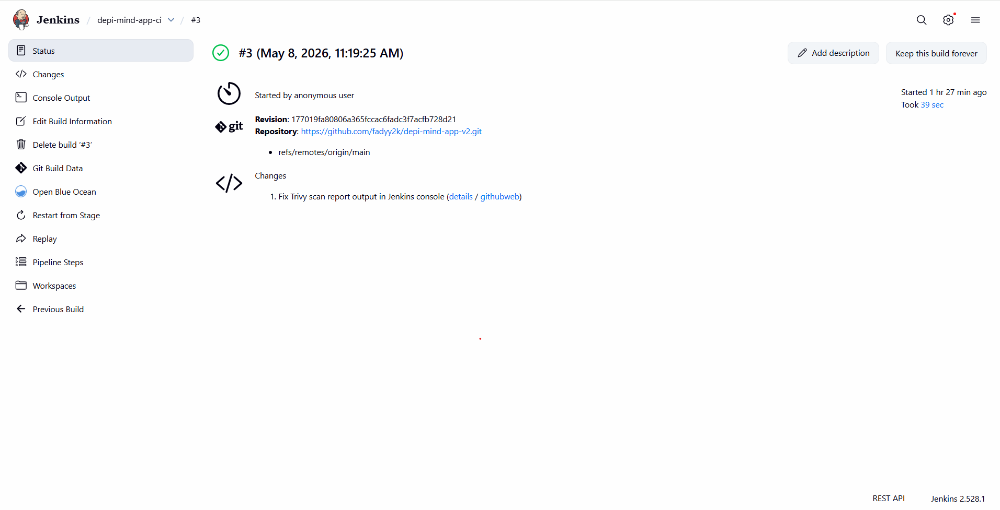

---

## 5. Jenkins Gitleaks Secret Scan

The Jenkins pipeline runs Gitleaks before building Docker images to check the repository for leaked secrets. Build #5 completed with no leaks found.

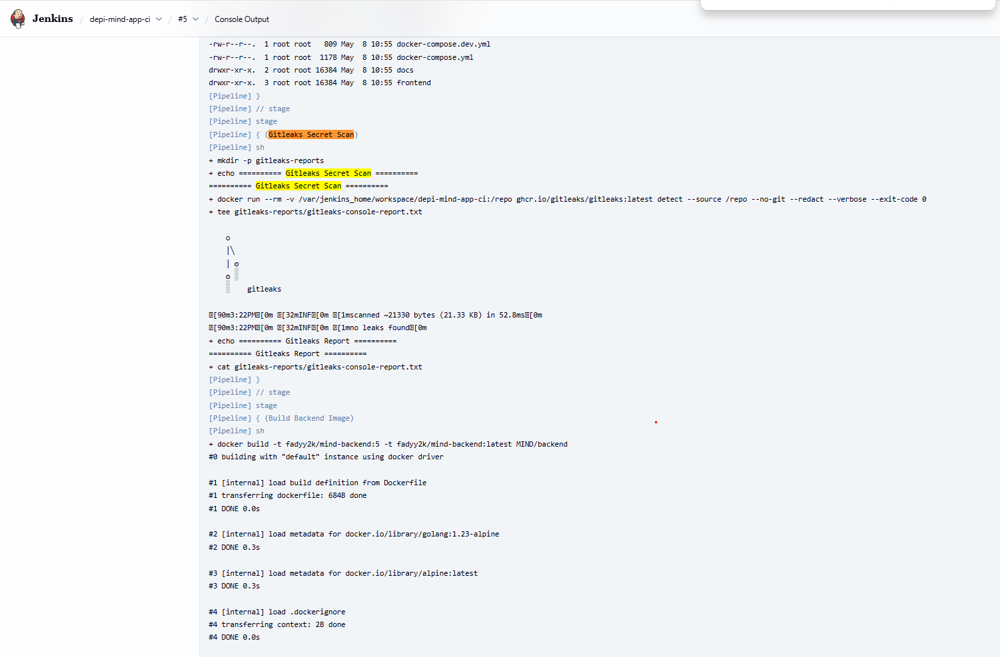

---

## 6. Jenkins Trivy Scan Output

Trivy security scanning is integrated into the Jenkins pipeline in report-only mode.

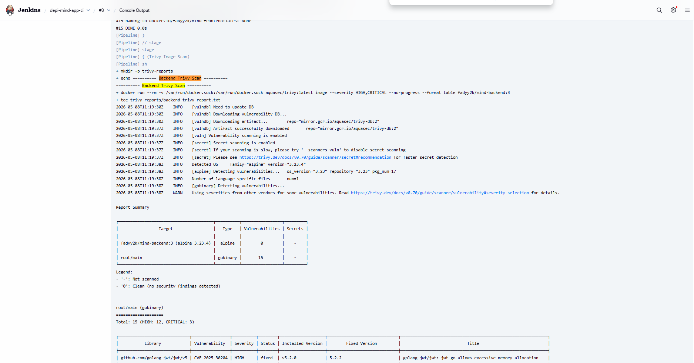

---

## 7. DockerHub Backend Image

The backend Docker image was built by Jenkins and pushed to DockerHub with versioned tags.

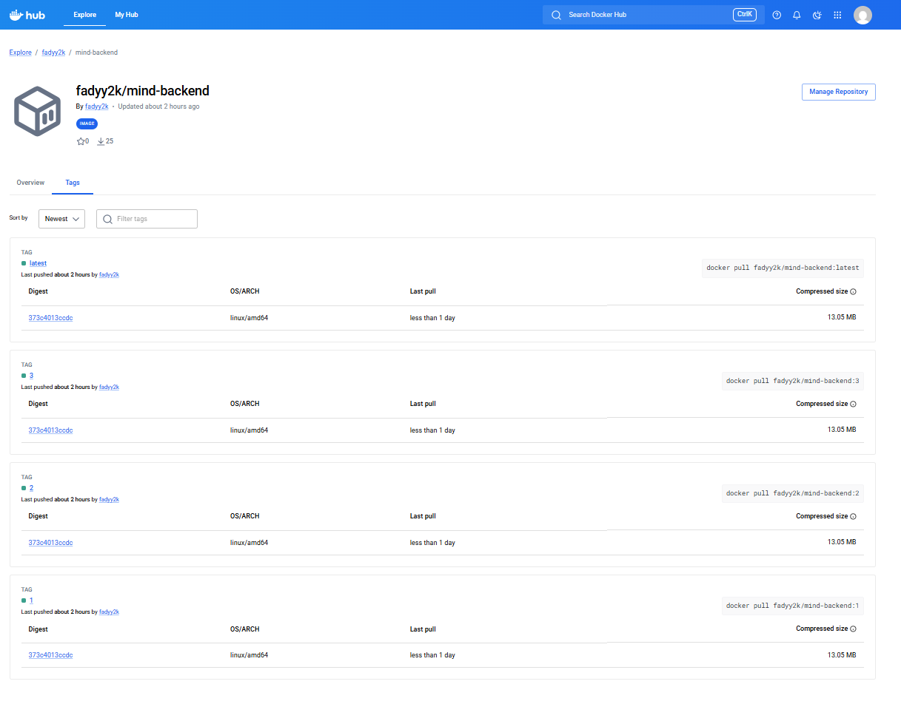

---

## 8. DockerHub Frontend Image

The frontend Docker image was built by Jenkins and pushed to DockerHub with versioned tags.

---

## 9. K3s Kubernetes Resources

The application is deployed on a single-node K3s Kubernetes cluster running on AWS EC2.

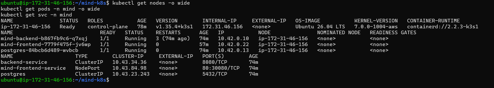

---

## 10. MIND App Running

The MIND Notes App is publicly accessible through the K3s NodePort service and DuckDNS.

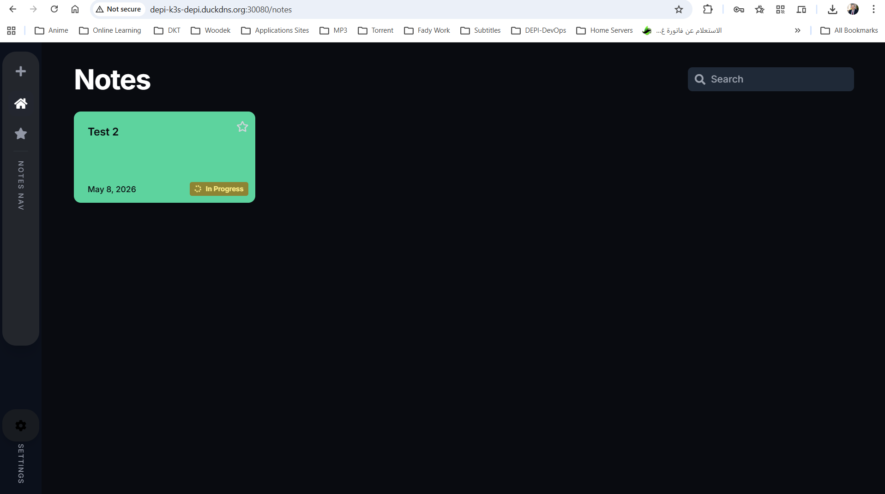

---

## 11. API Health Check

The backend API health endpoint confirms that the frontend proxy and backend service are working.

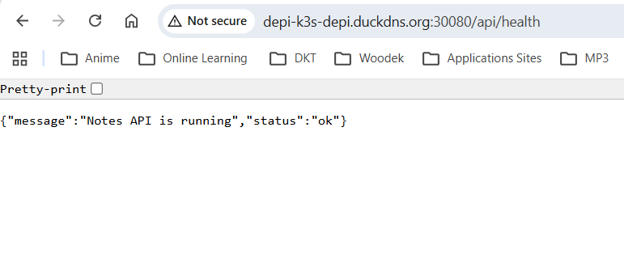

---

## 12. ArgoCD Synced and Healthy

ArgoCD manages the Kubernetes deployment from the GitHub repository and keeps the application synced.

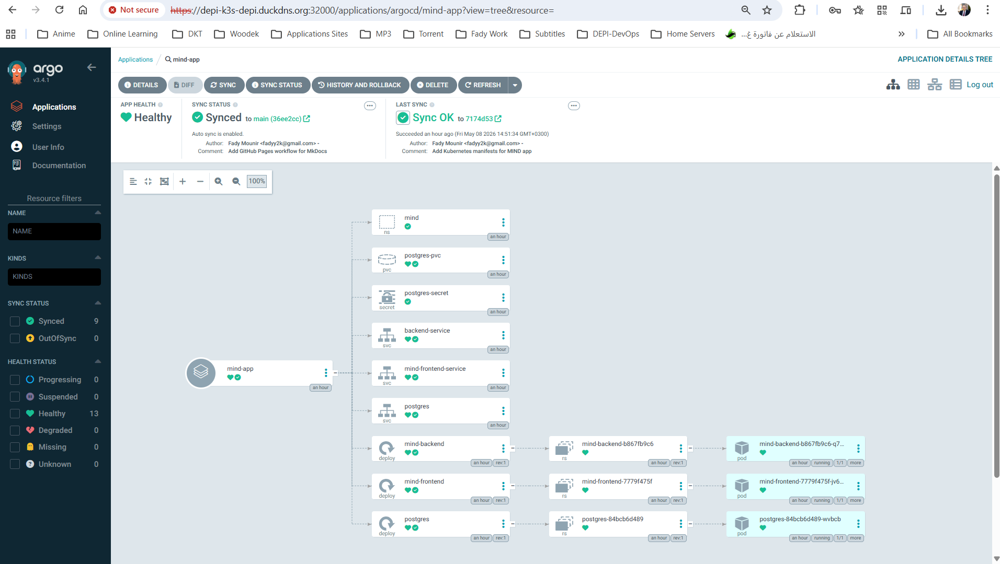

---

## 13. ArgoCD Self-Healing Test

A live drift test was performed by scaling the frontend deployment to zero replicas. ArgoCD detected the drift and restored the application back to the desired state from Git.

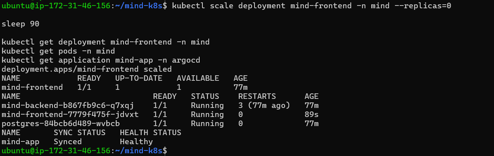
