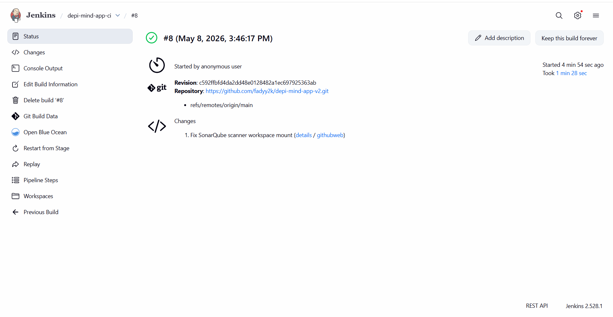
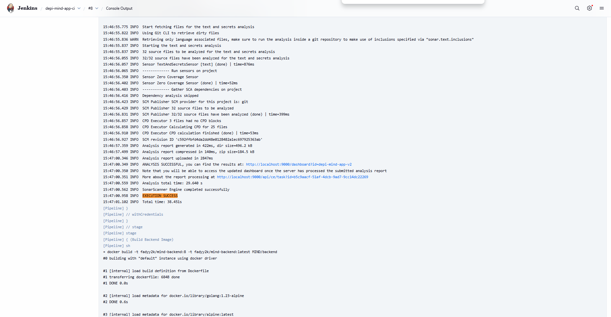
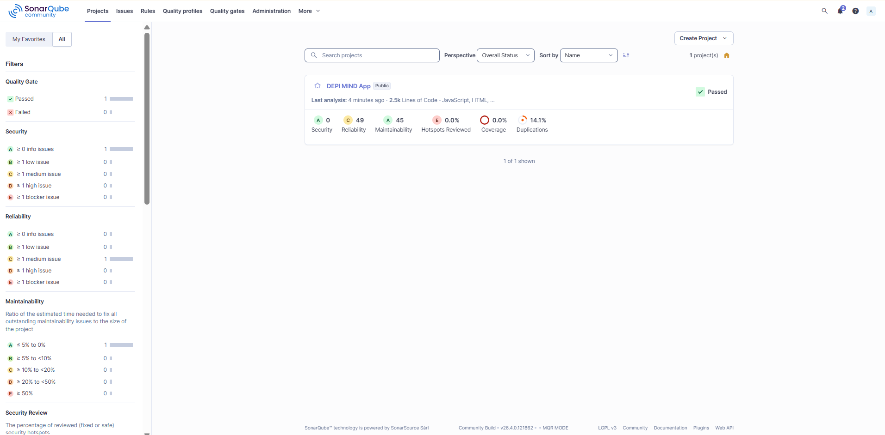

# Screenshots & Evidence

This page contains the complete visual evidence for every stage of the DevSecOps pipeline. Each screenshot proves a specific step was completed successfully.

---

## GitHub Repository


**What it shows:** The public GitHub repository containing all source code, Kubernetes manifests, Jenkins pipeline, MkDocs documentation source, and showcase code.

**Evidence:** The repository structure is visible including `MIND/`, `k8s/`, `Jenkinsfile`, `docs/`, `showcase/`, and `.github/workflows/`.

---

## MkDocs Documentation


**What it shows:** The live MkDocs Material documentation site deployed to GitHub Pages.

**Evidence:** The full documentation portal is live at [https://fadyy2k.github.io/depi-mind-app-v2/](https://fadyy2k.github.io/depi-mind-app-v2/)

---

## Jenkins Dashboard


**What it shows:** The Jenkins CI/CD server dashboard showing the pipeline job.

**Evidence:** Jenkins is live and accessible at [http://depi-jenkins-depi.duckdns.org:8080](http://depi-jenkins-depi.duckdns.org:8080)

---

## Jenkins — Successful Build (Early)


**What it shows:** An early successful Jenkins pipeline build.

**Evidence:** The pipeline was running and completing successfully from the beginning of the project.

---

## Jenkins — Build #8 (Final with Security Tools)



**What it shows:** Jenkins Build #8 — the final build that includes all stages: Gitleaks, SonarQube, Docker Build, Trivy, and DockerHub Push.

**Evidence:** All stages completed successfully in a single pipeline run.

---

## Jenkins Console — Gitleaks Scan


**What it shows:** The Jenkins console output from the Gitleaks stage showing the scan completed with no leaks detected.

**Key output:**
```
Successfully pulled gitleaks/gitleaks:latest
...
No leaks found
```

**Evidence:** Secret scanning is integrated into the pipeline and running before any build occurs.

---

## Jenkins Console — SonarQube Scan



**What it shows:** The Jenkins console output from the SonarQube stage showing the scanner running and uploading analysis results.

**Key output:**
```
INFO: Sensor JavaXmlSensor [java]
INFO: ANALYSIS SUCCESSFUL for project depi-mind-app-v2
INFO: Note that you will be able to access the updated dashboard once you have executed...
```

**Evidence:** Code quality scanning is integrated and submitting results to the SonarQube server.

---

## SonarQube Dashboard



**What it shows:** The SonarQube project dashboard for `DEPI MIND App` showing the analysis results and quality gate status.

**Evidence:** The quality gate passed. The project is visible in SonarQube at [http://depi-jenkins-depi.duckdns.org:9000](http://depi-jenkins-depi.duckdns.org:9000)

---

## Jenkins Console — Trivy Scan


**What it shows:** The Jenkins console output from the Trivy image scanning stage showing vulnerability scan results for both Docker images.

**Evidence:** Trivy is integrated into the pipeline and scanning images before they are pushed to DockerHub.

---

## DockerHub — Backend Image


**What it shows:** The DockerHub repository for `fadyy2k/mind-backend` showing published tags including `latest` and build-number tags.

**Evidence:** Backend images are being built and pushed to DockerHub by the Jenkins pipeline.

DockerHub URL: [https://hub.docker.com/r/fadyy2k/mind-backend](https://hub.docker.com/r/fadyy2k/mind-backend)

---

## DockerHub — Frontend Image


**What it shows:** The DockerHub repository for `fadyy2k/mind-frontend` showing published tags including `latest` and build-number tags.

**Evidence:** Frontend images are being built and pushed to DockerHub by the Jenkins pipeline.

DockerHub URL: [https://hub.docker.com/r/fadyy2k/mind-frontend](https://hub.docker.com/r/fadyy2k/mind-frontend)

---

## Kubernetes — Pods and Services


**What it shows:** The output of `kubectl get nodes`, `kubectl get pods -n mind`, and `kubectl get svc -n mind`.

**Evidence:**
- K3s node is `Ready`
- `mind-frontend` pod is `1/1 Running`
- `mind-backend` pod is `1/1 Running`
- `postgres` pod is `1/1 Running`
- All services are correctly configured

---

## MIND Notes App — Running


**What it shows:** The live MIND Notes App accessible in the browser.

**Evidence:** The full application is deployed and functional at [http://depi-k3s-depi.duckdns.org:30080](http://depi-k3s-depi.duckdns.org:30080)

Demo credentials: `demo@example.com` / `demo123456`

---

## API Health Endpoint


**What it shows:** The browser showing the API health endpoint response.

**Response:**
```json
{"message":"Notes API is running","status":"ok"}
```

**Evidence:** The backend Go API is running, healthy, and reachable through the Kubernetes NodePort.

URL: [http://depi-k3s-depi.duckdns.org:30080/api/health](http://depi-k3s-depi.duckdns.org:30080/api/health)

---

## ArgoCD — Synced and Healthy


**What it shows:** The ArgoCD dashboard showing the `mind-app` application with status **Synced** and **Healthy**.

**Evidence:** All Kubernetes resources are deployed, running, and matching the Git-declared state.

ArgoCD URL: [http://depi-k3s-depi.duckdns.org:32000](http://depi-k3s-depi.duckdns.org:32000)

---

## ArgoCD — Self-Healing Proof


**What it shows:** Evidence of ArgoCD self-healing after the frontend deployment was manually scaled to zero replicas.

**The test:**
1. `kubectl scale deployment mind-frontend -n mind --replicas=0` was run
2. The frontend pod terminated
3. ArgoCD detected drift from the desired Git state
4. ArgoCD restored the deployment to 1 replica within ~90 seconds
5. ArgoCD returned to **Synced** and **Healthy**

**Evidence:** GitOps self-healing is working correctly.

---

## Evidence Summary

| # | Screenshot | Stage | Result |
|---|---|---|---|
| 1 | `github-repo.png` | Source Control | Repository visible ✓ |
| 2 | `mkdocs-home.png` | Documentation | Live docs ✓ |
| 3 | `jenkins-dashboard.png` | CI/CD | Jenkins running ✓ |
| 4 | `jenkins-build-success.png` | CI/CD | Pipeline success ✓ |
| 5 | `jenkins-build-8-success.png` | CI/CD | Full pipeline ✓ |
| 6 | `jenkins-gitleaks-console.png` | Security | No leaks found ✓ |
| 7 | `jenkins-sonarqube-console.png` | Security | Analysis uploaded ✓ |
| 8 | `sonarqube-dashboard.png` | Security | Quality gate passed ✓ |
| 9 | `jenkins-trivy-console.png` | Security | Images scanned ✓ |
| 10 | `dockerhub-backend.png` | Registry | Image published ✓ |
| 11 | `dockerhub-frontend.png` | Registry | Image published ✓ |
| 12 | `k3s-pods.png` | Kubernetes | All pods running ✓ |
| 13 | `mind-app.png` | Application | App live ✓ |
| 14 | `api-health.png` | Application | API healthy ✓ |
| 15 | `argocd-synced.png` | GitOps | Synced + Healthy ✓ |
| 16 | `argocd-self-heal.png` | GitOps | Self-healing proven ✓ |
