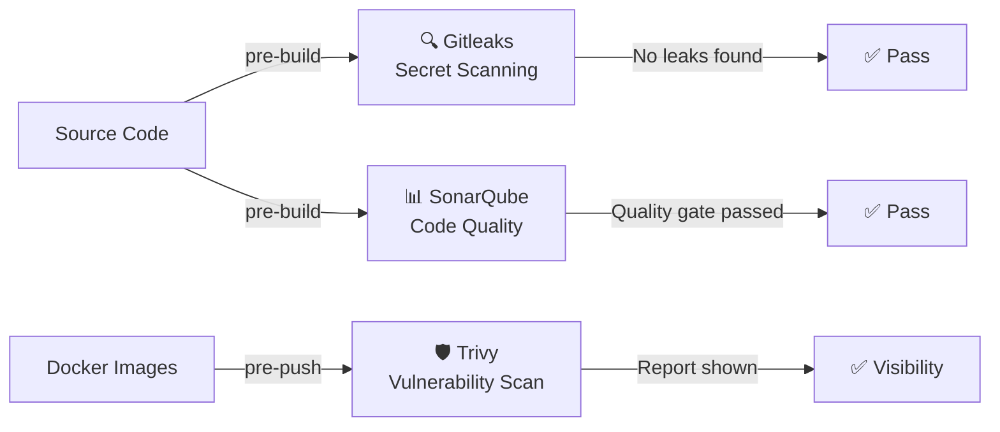

# Security Scanning

This project integrates three security tools as part of the DevSecOps pipeline. Security is not an afterthought — it is embedded directly into the CI/CD process so that every build is scanned before deployment.

---

## Security Tool Overview



---

## Gitleaks — Secret Scanning

### What Is Gitleaks?

Gitleaks is an open-source SAST (Static Application Security Testing) tool designed to detect secrets — passwords, API tokens, private keys, cloud credentials — accidentally committed to Git repositories.

### Why Is It Used Here?

A single accidentally committed credential (e.g., a DockerHub token or AWS access key) can be scraped from GitHub within minutes by automated bots. Gitleaks prevents this by scanning the full repository before any build begins.

If a secret is detected, the pipeline stops before any image is built or pushed. This prevents the compromised code from ever reaching production.

### How It Runs

```bash
docker run --rm -v ${WORKSPACE}:/path \
  ghcr.io/gitleaks/gitleaks:latest detect \
  --source=/path \
  --verbose \
  --exit-code=0 \
  --report-path=/path/gitleaks-reports/gitleaks-console-report.txt
```

Gitleaks runs inside its own Docker container and mounts the Jenkins workspace. No local installation is needed.

### Result

| Field | Value |
|---|---|
| Scan target | Full repository |
| Result | **No leaks found** |
| Report saved to | `gitleaks-reports/gitleaks-console-report.txt` |
| Stage behavior | Logs result, continues pipeline |

### Production Note

In this demo, `--exit-code=0` allows the pipeline to continue even if leaks are detected, ensuring the demo completes. **In production, remove `--exit-code=0`** so the pipeline fails immediately on any detected secret.

---

## SonarQube — Code Quality Analysis

### What Is SonarQube?

SonarQube is a leading static code analysis platform. It scans source code for:

- **Bugs** — code logic errors likely to cause runtime failures
- **Vulnerabilities** — security weaknesses (e.g., SQL injection risks, hardcoded credentials in logic)
- **Code Smells** — maintainability issues, technical debt
- **Duplications** — repeated code blocks
- **Quality Gate** — a pass/fail threshold that can block deployment

### Why Is It Used Here?

SonarQube integrates DevSecOps into the development lifecycle. Code quality is verified on every build — not just at release time. This catches issues early when they are cheapest to fix.

### How It Runs

```bash
docker run --rm \
  -e SONAR_HOST_URL=http://${SONAR_HOST} \
  -e SONAR_LOGIN=${SONAR_TOKEN} \
  -v ${WORKSPACE}:/usr/src \
  sonarsource/sonar-scanner-cli:latest \
  -Dsonar.projectKey=depi-mind-app-v2 \
  -Dsonar.projectName="DEPI MIND App" \
  -Dsonar.sources=MIND/backend,MIND/frontend
```

The scanner uploads results to the SonarQube server at `http://localhost:9000` on EC2 #1.

### SonarQube Server

| Field | Value |
|---|---|
| URL | [http://depi-jenkins-depi.duckdns.org:9000](http://depi-jenkins-depi.duckdns.org:9000) |
| Credentials | Demo credentials — live demo only |
| Project key | `depi-mind-app-v2` |
| Project name | `DEPI MIND App` |

### Result

| Field | Value |
|---|---|
| Project created | ✅ |
| Analysis uploaded | ✅ |
| Quality gate | **Passed** |
| Dashboard | Visible in SonarQube UI |

---

## Trivy — Container Vulnerability Scanning

### What Is Trivy?

Trivy (by Aqua Security) is an open-source vulnerability scanner for container images. It checks Docker images against multiple CVE databases including:

- NVD (National Vulnerability Database)
- Red Hat Security Advisory
- Debian Security Advisory
- Alpine SecDB
- And many others

Trivy detects OS-level vulnerabilities, library vulnerabilities, and configuration issues in the image layers.

### Why Is It Used Here?

Building a Docker image does not mean the image is secure. Base images (e.g., `node:alpine`, `golang:1.21`) may contain known CVEs in their installed packages. Trivy catches these before the image is deployed.

### How It Runs

```bash
trivy image --exit-code 0 --severity HIGH,CRITICAL fadyy2k/mind-backend
trivy image --exit-code 0 --severity HIGH,CRITICAL fadyy2k/mind-frontend
```

Trivy scans both images and outputs results to the Jenkins console log.

### Result

| Field | Value |
|---|---|
| Images scanned | `fadyy2k/mind-backend`, `fadyy2k/mind-frontend` |
| Severity filter | HIGH, CRITICAL |
| Result | Scan output displayed in Jenkins console |
| Pipeline behavior | Report-only (does not block build) |

### Why Report-Only in Demo?

The goal of this demo is to prove that vulnerability scanning is integrated. Blocking pipelines based on vulnerability severity requires organizational policy decisions about acceptable risk, false positive handling, and exception workflows. Implementing this without that context would halt the demo pipeline on every run due to transitive dependency CVEs in base images.

### Production Target

Remove `--exit-code 0` and configure a policy:

```bash
# Fail pipeline if any HIGH or CRITICAL vulnerability has no accepted exception
trivy image --exit-code 1 --severity HIGH,CRITICAL fadyy2k/mind-backend
```

Also consider:
- **Trivy ignore file** (`.trivyignore`) for accepted/false-positive CVEs
- **Automatic SBOM generation** (Software Bill of Materials) using Syft
- **Integration with a vulnerability management platform** for tracking and remediation

---

## Secret Management

!!! danger "What Is Never Published"
    The following are **never stored** in any file in this repository:

    - ArgoCD admin password
    - SonarQube password or token
    - DockerHub API token
    - GitHub personal access token
    - SSH private keys
    - `.pem` files
    - AWS access keys or secret keys
    - Any cloud provider credentials

All sensitive values are stored **exclusively** in Jenkins Credentials Manager, encrypted at rest, and injected into the pipeline at runtime via `withCredentials()` blocks.

### Jenkins Credentials Architecture

```
Jenkins Credentials Store (encrypted)
        │
        ├── dockerhub-creds     → injected into docker login stage
        ├── github-creds        → injected into checkout stage
        └── sonarqube-token     → injected into SonarQube stage

Source code / YAML / docs = NO credentials
```

---

## Security Scan Summary

| Tool | Stage | Result | Production Action |
|---|---|---|---|
| **Gitleaks** | Pre-build | No leaks found ✓ | Fail pipeline on any leak |
| **SonarQube** | Pre-build | Quality gate passed ✓ | Enforce quality gate blocking |
| **Trivy** | Pre-push | Report shown ✓ | Fail on HIGH/CRITICAL CVEs |

---

## What Could Be Added for Production

| Enhancement | Tool / Approach |
|---|---|
| Secrets management vault | HashiCorp Vault or AWS Secrets Manager |
| DAST (Dynamic App Security Testing) | OWASP ZAP or Burp Suite |
| Dependency scanning | OWASP Dependency-Check |
| SBOM generation | Syft + Grype |
| Image signing | Cosign (Sigstore) |
| Network policies | Kubernetes NetworkPolicy |
| Runtime threat detection | Falco |
| TLS everywhere | cert-manager + Let's Encrypt |
