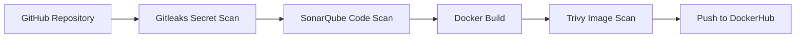

# Security Scanning

  
DevSecOps Controls

  <h1>Security and quality built into the pipeline</h1>
  

    The project includes three layers of CI security visibility: secret detection, static code analysis,
    and container image vulnerability scanning.
  

## Security Layers

  

    <h3>Gitleaks</h3>
    
Runs before Docker build to detect secrets inside the repository.

  

  

    <h3>SonarQube</h3>
    
Analyzes source code quality, maintainability, and reliability.

  

  

    <h3>Trivy</h3>
    
Scans Docker images for OS and dependency vulnerabilities.

  

## Security Flow

## Current Demo Mode

| Tool | Mode | Result |
|---|---|---|
| Gitleaks | Report / non-blocking | No leaks found evidence |
| SonarQube | Report / quality gate visibility | Project analysis available |
| Trivy | Report-only | Vulnerability visibility without blocking demo |

!!! tip "Production improvement"
    In production, the pipeline should fail when Gitleaks finds secrets, when SonarQube quality gate fails, or when Trivy finds unacceptable HIGH/CRITICAL vulnerabilities.

## Why this matters

Security is not left until after deployment. It is part of the delivery flow, which makes the project a real DevSecOps demonstration rather than only a CI/CD deployment.
