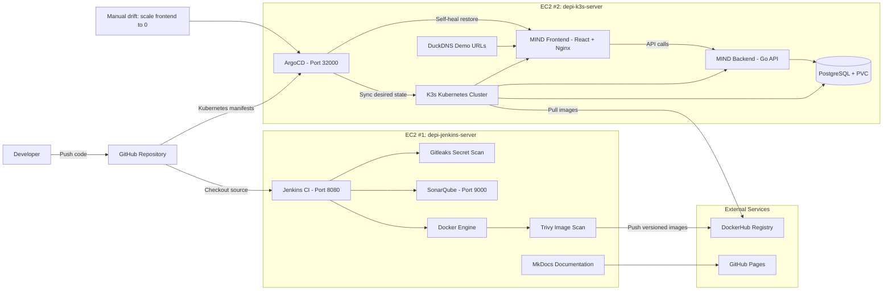

# DEPI DevSecOps Project — Full Documentation

## Project Summary

This project demonstrates a complete DevSecOps workflow for the MIND Notes App.

The flow starts from GitHub, runs through Jenkins CI, adds Gitleaks, SonarQube, and Trivy security visibility, builds Docker images, publishes them to DockerHub, and deploys the application to K3s Kubernetes using ArgoCD GitOps.

## Toolchain

```text
GitHub → Jenkins → Gitleaks → SonarQube → Docker Build → Trivy → DockerHub → ArgoCD → K3s Kubernetes
```

## Live Demo Links

| Service | URL | Access |
|---|---|---|
| GitHub Repository | https://github.com/fadyy2k/depi-mind-app-v2 | Public |
| MkDocs Site | https://fadyy2k.github.io/depi-mind-app-v2/ | Public |
| Jenkins | http://depi-jenkins-depi.duckdns.org:8080 | No login required |
| MIND App | http://depi-k3s-depi.duckdns.org:30080 | demo@example.com / demo123456 |
| API Health | http://depi-k3s-depi.duckdns.org:30080/api/health | Public |
| ArgoCD | http://depi-k3s-depi.duckdns.org:32000 | Demo only |
| SonarQube | http://depi-jenkins-depi.duckdns.org:9000 | Demo only |

Security note: do not publish real admin passwords, tokens, SSH keys, cloud credentials, or `.pem` files.

## Full Infrastructure Diagram



## EC2 Server Roles

### EC2 #1 — depi-jenkins-server

Purpose: CI/CD, build, security scanning, quality analysis, and documentation.

Contains:

- Jenkins on port 8080
- Docker Engine for image builds
- Gitleaks secret scanning
- SonarQube on port 9000
- Trivy image scanning
- MkDocs documentation files
- Jenkins credentials manager for GitHub, DockerHub, and SonarQube token

### EC2 #2 — depi-k3s-server

Purpose: production-like runtime environment.

Contains:

- K3s Kubernetes single-node cluster
- ArgoCD for GitOps deployment
- MIND frontend deployment
- MIND backend deployment
- PostgreSQL database deployment
- Persistent Volume Claim for database persistence
- NodePort exposure for MIND App and ArgoCD
- DuckDNS dynamic DNS update

## CI/CD Pipeline Stages

| Stage | Purpose |
|---|---|
| Checkout | Pull code from GitHub |
| Show Workspace | Validate repository structure |
| Gitleaks Secret Scan | Detect leaked credentials before build |
| SonarQube Code Scan | Static code quality and reliability analysis |
| Build Backend Image | Build Go backend Docker image |
| Build Frontend Image | Build React/Nginx frontend Docker image |
| Trivy Image Scan | Scan Docker images for vulnerabilities |
| DockerHub Login | Authenticate to DockerHub |
| Push Images | Push versioned and latest image tags |
| Docker Logout | Remove registry session |

## GitOps and Self-Healing

ArgoCD continuously watches the Kubernetes manifests in GitHub. If the live cluster state differs from Git, ArgoCD detects the drift and restores the desired state.

Demo proof:

```bash
kubectl scale deployment mind-frontend -n mind --replicas=0

# After ArgoCD self-heal:
mind-frontend: 1/1 Running
mind-app: Synced / Healthy
```

## Production Improvements

- HTTPS/TLS
- Private networking
- Managed secrets
- Stronger backup strategy
- Monitoring and logging
- Enforced quality/security gates
- Resource requests and limits
- Ingress controller instead of raw NodePorts
